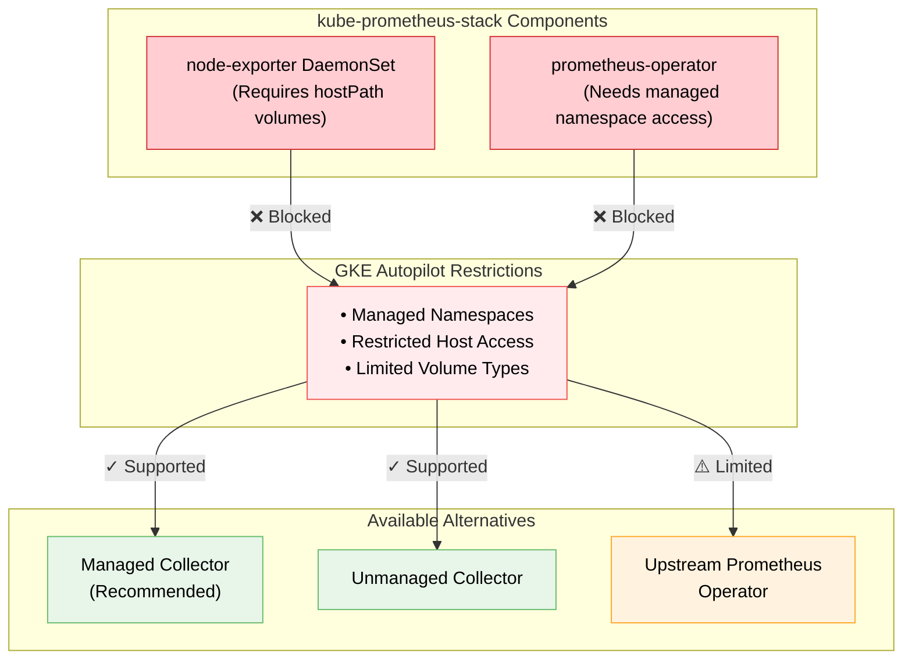
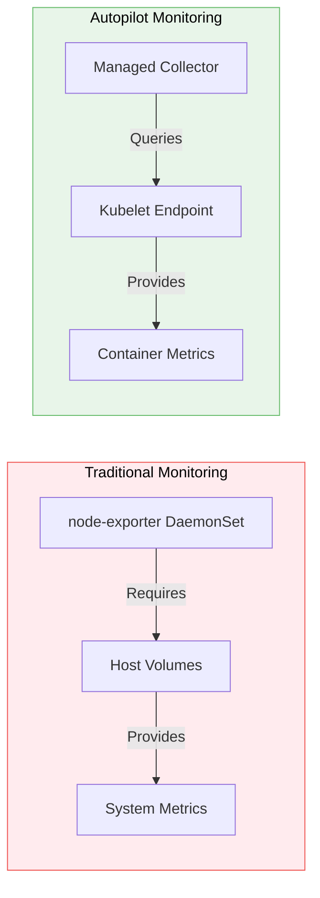

The DaemonSet isn't visible because GKE Autopilot restricts certain Kubernetes resources and configurations that require elevated privileges 0:3. When you installed kube-prometheus-stack, the node-exporter DaemonSet failed to deploy due to Autopilot's security controls.

Here's what's happening in your cluster:



Instead of trying to force the DaemonSet deployment, you have several alternatives available:

**Managed Collector (Recommended)**- Sends metrics to GCP's managed Prometheus service
- Specifically designed to work with Autopilot restrictions
- Requires minimal configuration

**Unmanaged Collector**- Acts as a drop-in replacement for prometheus-server
- Works differently from upstream prometheus server
- Still compatible with Autopilot restrictions

**Modified Upstream Prometheus Operator**- Can be made to work with limited functionality
- Requires careful configuration to avoid restricted resources
- Not recommended as primary solution

To implement the recommended solution (Managed Collector), you can use this kubectl method 1:2:

```bash
kubectl apply -f https://raw.githubusercontent.com/GoogleCloudPlatform/prometheus-engine/v0.4.3-gke.0/examples/pod-monitoring.yaml
```

This approach avoids the DaemonSet entirely while providing the monitoring functionality you need. The Managed Collector is specifically designed to work within Autopilot's security constraints while still providing comprehensive cluster monitoring capabilities.

Would you like me to provide more details about implementing the Managed Collector approach?

The DaemonSet (node-exporter) is traditionally important for comprehensive cluster monitoring, but it's not strictly necessary in GKE Autopilot. Here's why:

| Functionality | Traditional Approach (DaemonSet) | Autopilot Alternative |
| --- | --- | --- |
| Node Metrics | Direct collection via hostPath volumes | Available through Kubelet endpoint |
| System Resources | Full access to system metrics | Limited to container-level metrics |
| Performance Data | Detailed CPU, memory, disk usage | Container resource usage metrics |
| Security Context | Requires elevated privileges | Works within Autopilot's security model |

Here's how the monitoring architecture differs between traditional and Autopilot approaches:



In the diagram above:

- Red section shows traditional monitoring requiring elevated privileges
- Green section shows Autopilot-compatible approach working within security constraints

Practical Implications:

 What Works Without DaemonSet- Container resource monitoring
- Basic node health checks
- Pod-level metrics collection
- Service discovery and monitoring

 What You'll Miss Without DaemonSet- Detailed disk usage metrics
- System-level CPU and memory statistics
- Network interface details
- Filesystem information

Recommendations:

- If you're running production workloads on Autopilot, use the Managed Collector approach
- Focus on container-level metrics rather than host-level metrics
- Consider using Stackdriver/GCP Monitoring for additional insights if needed

Would you like specific guidance on implementing the Managed Collector approach for your use case?