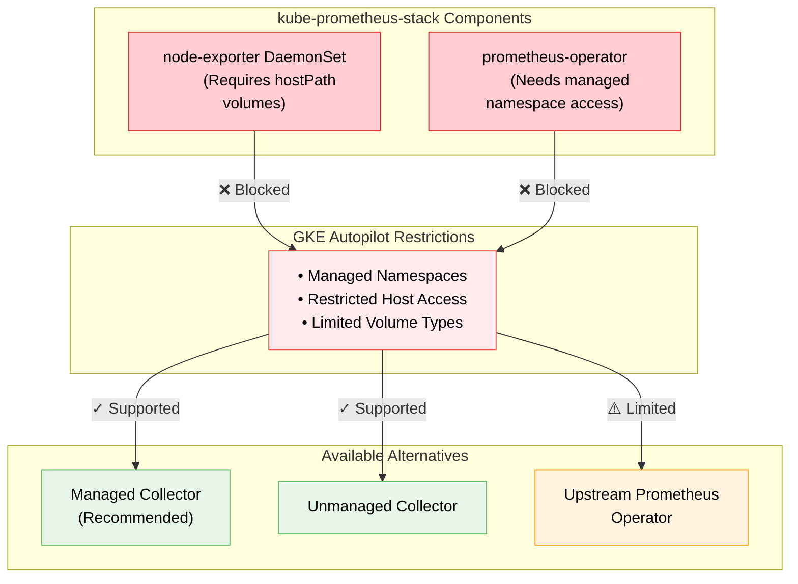
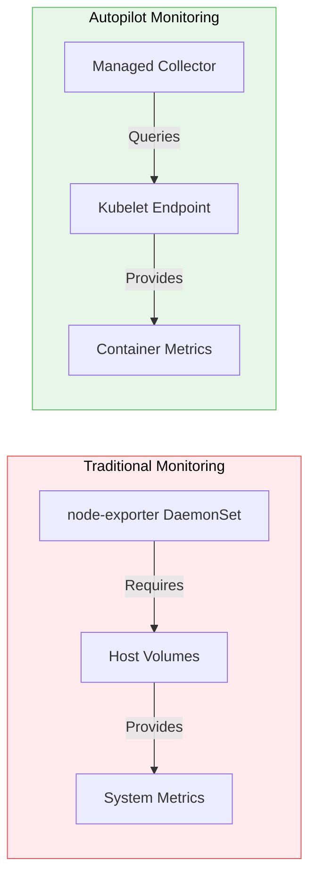
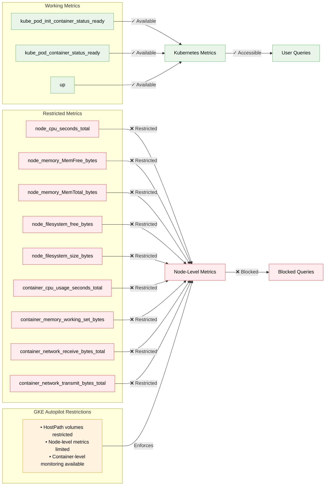
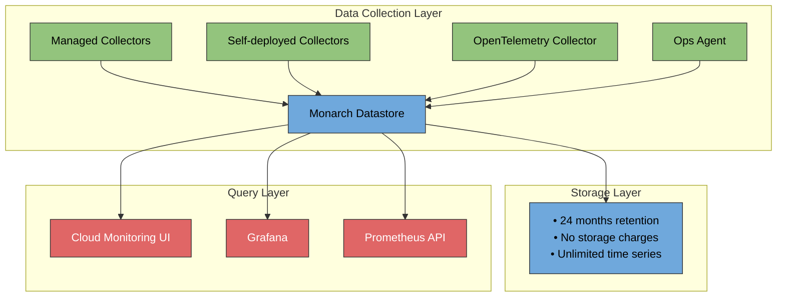
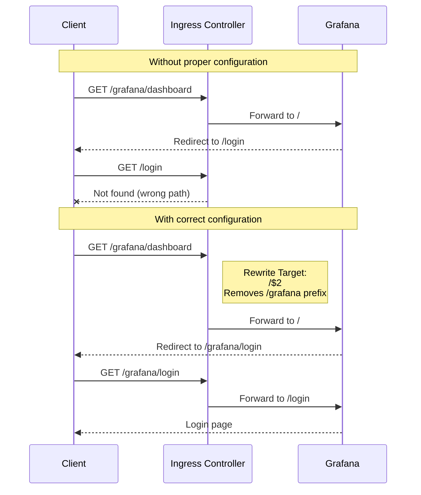

# Table of contents
- [Table of contents](#table-of-contents)
- [Collect metrics on GKE Autopilot](#collect-metrics-on-gke-autopilot)
- [Container CPU usage percentage](#container-cpu-usage-percentage)
- [Memory usage ratio](#memory-usage-ratio)
- [Network traffic](#network-traffic)
- [Second dialog with phind](#second-dialog-with-phind)
    - [How It Works](#how-it-works)
    - [Integration with Your Existing Setup](#integration-with-your-existing-setup)
    - [Cost Structure](#cost-structure)
    - [Setup Process](#setup-process)
- [Ingress paths](#ingress-paths)
    - [Understanding Container File Permissions](#understanding-container-file-permissions)

# Collect metrics on GKE Autopilot

The DaemonSet isn't visible because GKE Autopilot restricts certain Kubernetes resources and configurations that require elevated privileges 0:3. When you installed kube-prometheus-stack, the node-exporter DaemonSet failed to deploy due to Autopilot's security controls.

Here's what's happening in your cluster:



Instead of trying to force the DaemonSet deployment, you have several alternatives available:

**Managed Collector (Recommended)**- Sends metrics to GCP's managed Prometheus service
- Specifically designed to work with Autopilot restrictions
- Requires minimal configuration

**Unmanaged Collector**- Acts as a drop-in replacement for prometheus-server
- Works differently from upstream prometheus server
- Still compatible with Autopilot restrictions

**Modified Upstream Prometheus Operator**- Can be made to work with limited functionality
- Requires careful configuration to avoid restricted resources
- Not recommended as primary solution

To implement the recommended solution (Managed Collector), you can use this kubectl method 1:2:

```bash
kubectl apply -f https://raw.githubusercontent.com/GoogleCloudPlatform/prometheus-engine/v0.4.3-gke.0/examples/pod-monitoring.yaml
```

This approach avoids the DaemonSet entirely while providing the monitoring functionality you need. The Managed Collector is specifically designed to work within Autopilot's security constraints while still providing comprehensive cluster monitoring capabilities.

Would you like me to provide more details about implementing the Managed Collector approach?

The DaemonSet (node-exporter) is traditionally important for comprehensive cluster monitoring, but it's not strictly necessary in GKE Autopilot. Here's why:

| Functionality | Traditional Approach (DaemonSet) | Autopilot Alternative |
| --- | --- | --- |
| Node Metrics | Direct collection via hostPath volumes | Available through Kubelet endpoint |
| System Resources | Full access to system metrics | Limited to container-level metrics |
| Performance Data | Detailed CPU, memory, disk usage | Container resource usage metrics |
| Security Context | Requires elevated privileges | Works within Autopilot's security model |

Here's how the monitoring architecture differs between traditional and Autopilot approaches:



In the diagram above:

- Red section shows traditional monitoring requiring elevated privileges
- Green section shows Autopilot-compatible approach working within security constraints

Practical Implications:

 What Works Without DaemonSet- Container resource monitoring
- Basic node health checks
- Pod-level metrics collection
- Service discovery and monitoring

 What You'll Miss Without DaemonSet- Detailed disk usage metrics
- System-level CPU and memory statistics
- Network interface details
- Filesystem information

Recommendations:

- If you're running production workloads on Autopilot, use the Managed Collector approach
- Focus on container-level metrics rather than host-level metrics
- Consider using Stackdriver/GCP Monitoring for additional insights if needed

Would you like specific guidance on implementing the Managed Collector approach for your use case?

Based on your feedback, I notice you're successfully getting data from Kubernetes-specific metrics but not from the node-level metrics. This is actually quite normal in GKE Autopilot environments, and I can explain why.

Let's visualize what's happening in your environment:



This behavior occurs because GKE Autopilot implements specific security restrictions 0:3. While Kubernetes-level metrics (like pod status and readiness) are available, node-level metrics require hostPath volumes and elevated privileges that Autopilot restricts for security reasons.

- Metrics like node_cpu_seconds_total and node_filesystem_size_bytes are unavailable because GKE Autopilot restricts access to node-level metrics.   
- Metrics like kube_pod_* are working because they are Kubernetes-level metrics that are accessible in Autopilot.   

Here are some working alternatives you can use instead:

Container Resource Usage```promql
# Container CPU usage percentage
rate(container_cpu_usage_seconds_total[5m]) * 100

# Memory usage ratio
container_memory_working_set_bytes / container_memory_limit_bytes * 100

# Network traffic
rate(container_network_receive_bytes_total[5m])
rate(container_network_transmit_bytes_total[5m])
```

Pod-Level Health Metrics
```promql
# Pod status summary
kube_pod_status_ready
kube_pod_status_running

# Container restart counts
changes(kube_container_status_restarts_total[24h])

# Pod resource limits vs requests
sum(kube_pod_container_resource_limits_cpu_core)
sum(kube_pod_container_resource_requests_memory_bytes)
```

These metrics will give you similar insights while working within Autopilot's security model. Would you like me to explain any of these alternatives in more detail or suggest additional queries for specific monitoring needs?   

# Second dialog with phind

https://www.phind.com/search/cm8eaf7cm0000356qvb7df6hm   

Google Cloud Managed Service for Prometheus is Google's fully managed solution for collecting, storing, and querying Prometheus metrics 0:2. Since you're already running a GKE cluster in Autopilot mode, you'll benefit from its native integration with this service.

### How It Works

Managed Service for Prometheus operates differently from traditional Prometheus setups by distributing responsibilities across multiple specialized components:



In this architecture:

- Green components show the collection layer where metrics are gathered
- Blue represents the storage layer handling data retention
- Red indicates the query layer where you access your metrics

Each collection method serves different use cases:

- Managed Collectors are ideal for GKE environments like yours
- Self-deployed collectors maintain compatibility with existing Prometheus setups
- OpenTelemetry Collector provides unified metrics, logs, and traces collection
- Ops Agent is optimized for Compute Engine instances

### Integration with Your Existing Setup

Since you're running GKE Autopilot, you already have Managed Service for Prometheus partially configured 1:5. Your existing Prometheus/Grafana setup can integrate seamlessly because:

- It maintains compatibility with upstream Prometheus
- Your existing Grafana dashboards continue to work without modification
- PromQL queries remain unchanged
- All metrics are accessible through the same interfaces you're currently using

### Cost Structure

- Billing is primarily based on metric samples ingested into storage
- There's a small charge for read API calls
- Storage and retention (24 months) are provided at no extra cost 0:9

### Setup Process

Enable Managed Service for Prometheus in your projectConfigure metrics collection using managed collectors (recommended for GKE Autopilot)Update your Grafana configuration to connect to Monarch instead of your local Prometheus serverVerify your existing targets are being scraped correctly### Important Considerations

- Minimum scrape interval is 5 seconds
- Data granularity:
  - Full resolution for 1 week
  - Downsampled to 1-minute points for next 5 weeks
  - Downsampled to 10-minute points thereafter 0:7


- Default ingest quota: 500 QPS per project
- Default read quota: 100 QPS per metrics scope 0:10   


# Ingress paths

https://stackoverflow.com/questions/56010759/unable-to-get-a-grafana-helm-charts-url-to-work-with-subpath   
https://medium.com/@tinhtq97/configuring-access-to-prometheus-and-grafana-via-sub-paths-89c578577e8d   
https://fabianlee.org/2022/07/02/prometheus-exposing-prometheus-grafana-as-ingress-for-kube-prometheus-stack/   


- /grafana
- /prometheus
- /alertmanager

The issue occurs because Grafana doesn't know it's being served from a sub-path, causing authentication redirects to fail. Here's how to fix it:

First, create a `values.yaml` file with these configurations:```yaml
grafana:
  env:
    GF_SERVER_SERVE_FROM_SUB_PATH: true
  grafana.ini:
    server:
      root_url: "%(protocol)s://%(domain)s/grafana/"
      serve_from_sub_path: true
```

Update your ingress configuration to include the rewrite annotation:```yaml
apiVersion: networking.k8s.io/v1
kind: Ingress
metadata:
  name: grafana
  annotations:
    kubernetes.io/ingress.class: "nginx"
    nginx.ingress.kubernetes.io/rewrite-target: /$2
spec:
  rules:
  - host: your-domain.com
    http:
      paths:
      - path: /grafana(/|$)(.*)
        pathType: Prefix
        backend:
          service:
            name: your-grafana-service
            port:
              number: 80
```



The diagram above illustrates why the configuration matters:

- Without proper configuration (top half): When you visit `/grafana/dashboard`, Grafana tries to redirect to `/login` directly, which fails because the ingress expects all paths to start with `/grafana`
- With our configuration (bottom half):
  1. The ingress receives `/grafana/dashboard` and uses the rewrite target to forward to `/` internally
  2. Grafana knows it's serving from a sub-path due to `GF_SERVER_SERVE_FROM_SUB_PATH: true`
  3. When redirecting to login, Grafana correctly prefixes the path with `/grafana`
  4. The ingress handles this correctly thanks to the rewrite annotation


Apply these changes by updating your existing installation:

```bash
helm upgrade grafana prometheus-community/kube-prometheus-stack -f values.yaml
```

Important notes- Make sure your ingress controller supports path rewriting (most modern controllers do)
- Clear your browser cache after applying these changes
- If using HTTPS, ensure your certificates cover the correct domain
- Test authentication flows thoroughly after deployment

These changes will allow Grafana to properly handle authentication and routing while being served from the `/grafana` path.

To modify the grafana.ini file directly in the pod, you'll need to understand the container's filesystem permissions and proper ways to edit configuration files. Let me explain the concepts first, then show you several approaches to solve this.

### Understanding Container File Permissions

Container filesystems typically have restricted permissions for security reasons. The grafana.ini file is owned by the grafana user (UID 472) and group (GID 472), with read-only permissions for the grafana user. When you try to edit it directly, you encounter permission denied errors because:

- Your session runs as a different user
- The file has restricted permissions
- The container's filesystem is designed to be immutable

Let's look at several approaches to handle this situation:

Use Helm Values File (Recommended)```yaml
grafana:
  grafana.ini:
    server:
      root_url: "%(protocol)s://%(domain)s/grafana/"
      serve_from_sub_path: true
```

- Proper Kubernetes way to manage configuration
- Survives pod restarts and upgrades
- Version controlled with rest of infrastructure
- Automatically applied during deployment
- Requires helm upgrade to take effect
- Needs planning for configuration changes
This approach uses Helm's built-in configuration management. Apply it with `helm upgrade -f values.yaml`. Changes persist across pod restarts and upgrades because they're part of your infrastructure configuration.Temporary Pod Modification```bash
# 1. Check current permissions
kubectl exec -it grafana-pod -- ls -l /etc/grafana/grafana.ini

# 2. Edit with elevated privileges
kubectl exec -it grafana-pod -- /bin/bash
chown grafana:grafana /etc/grafana/grafana.ini
chmod 644 /etc/grafana/grafana.ini
nano /etc/grafana/grafana.ini

# 3. Verify changes
cat /etc/grafana/grafana.ini
```

- Quick for temporary debugging
- Direct access to file system
- Immediate feedback
- Changes lost on pod restart
- Not recommended for production
- Violates container immutability principle
This method temporarily modifies permissions to edit the file directly. While useful for debugging, changes won't persist across pod restarts. Use this only for testing configurations before moving them to your values.yaml file.### Best Practices

Always prefer configuration management through Helm valuesDocument all configuration changes in version controlTest changes in development environment firstAvoid direct file modifications in production containersContainer filesystems are designed to be ephemeral. Any direct modifications to files inside containers should be considered temporary and used only for debugging purposes. For permanent changes, always use proper Kubernetes configuration management tools like Helm values files.